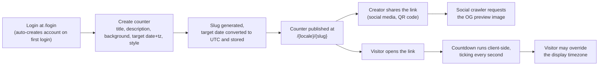

# Product Overview

**Summary:** Countdown Generator lets an authenticated user create shareable countdown ("counter") pages for a future date — a launch, an event, a deadline — each published at its own public URL. This document explains the core concepts, who can do what, and how a counter moves from creation to being viewed by the public. For the detailed rule set behind each feature, see [`features-and-rules.md`](features-and-rules.md).

## Index

1. [Purpose](#purpose)
2. [Core Concepts](#core-concepts)
3. [User Roles](#user-roles)
4. [End-to-End Flow](#end-to-end-flow)
5. [Counter Lifecycle](#counter-lifecycle)

---

## Purpose

The product exists to generate expectation around a future moment and make it easy to distribute: a user sets a target date, gets a unique link, and that link renders a live, styled countdown to anyone who opens it — timed the same instant for every visitor regardless of where they are, because the target is stored and compared in UTC and each visitor's browser computes the remaining time locally.

## Core Concepts

- **Counter**: the core entity. Represents one countdown — a title, an optional description, a background (image or video), a target date + timezone, a visual style, optional social links, and an on/off (`enabled`) flag. Owned by exactly one user.
- **Slug**: a URL-safe identifier derived from the counter's title (e.g. "Lanzamiento 2026" → `lanzamiento-2026`), unique across all counters. It's what appears in the public URL: `/{locale}/{slug}`.
- **Target date + timezone**: the creator enters a local date/time in a chosen IANA timezone; the system converts and stores it as an absolute UTC timestamp. This is what guarantees the countdown reaches zero at the same real-world instant for everyone.
- **Visual style**: one of several pre-built countdown layouts (classic, blocks, flip clock, rings, bars, glassmorphism, seven-segment) the creator picks when creating or editing a counter.
- **Locale**: every page — public countdown included — is served under a locale prefix (`en` or `es`); the counter's content itself (title, description) is whatever the creator typed, not translated per locale.

## User Roles

- **USER**: can create, edit, and delete their own counters, capped at `maxCounters` (default 10, configurable per user by an admin).
- **ADMIN**: no counter cap; can additionally manage all users (block/unblock, change role, adjust `maxCounters`, delete) and all counters across all users (enable/disable, delete, create a counter on behalf of any user) via the `/admin/users` and `/admin/links` sections.

## End-to-End Flow

Two entry points exist for sharing: a plain link to `/{locale}/{slug}`, and a dedicated QR-code page (`/{locale}/{slug}/qr`) rendering the same URL as a scannable code.

## Counter Lifecycle

- **Creation**: only by an authenticated user, subject to their `maxCounters` cap (admins exempt). Fails with a validation error if title, date, or timezone is missing.
- **Editing**: the owner (or an admin, via the admin links section) can update any field. Ownership is checked server-side before every update or delete — a user can never mutate another user's counter directly.
- **Enable/disable**: a disabled counter's public page and OG image both return "not found" behavior instead of the countdown; the record itself isn't deleted. Admins can disable a counter, or disable every counter belonging to a given user in one action.
- **Deletion**: permanently removes the counter row. Available to its owner or an admin.
