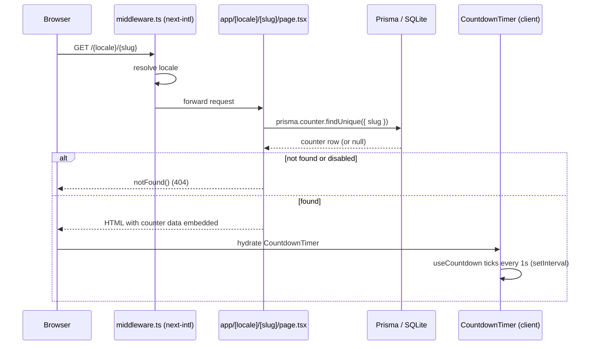
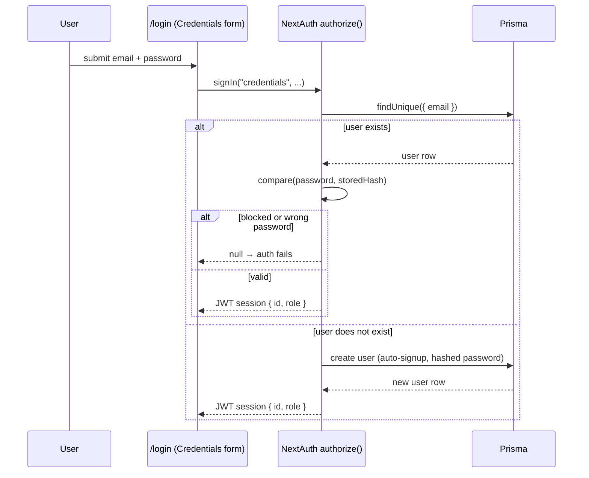
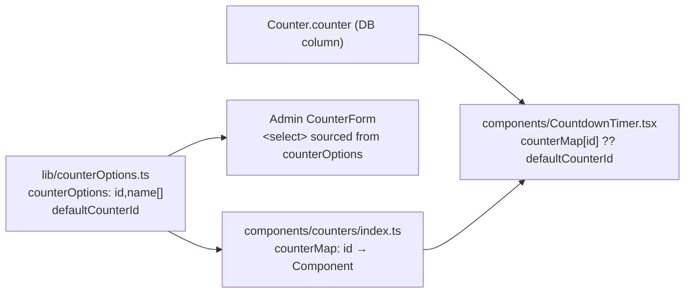
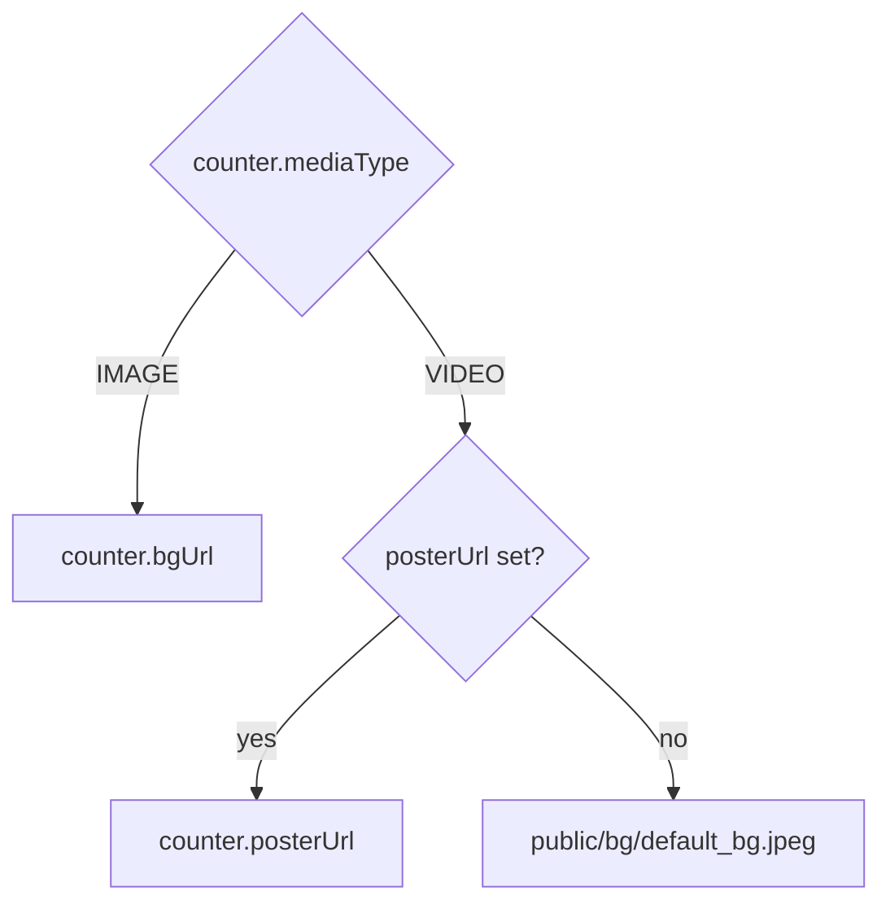

# Architecture

**Summary:** Countdown Generator is a Next.js 14 App Router application. Every route is locale-prefixed and rendered mostly on the server; the countdown itself ticks on the client. Data lives in SQLite behind Prisma, mutated exclusively through Server Actions — there is no separate REST/API layer for CRUD. This document walks through the stack, the folder layout, and the main request/data flows, including the two extension points that get touched most often: the counter-style plugin system and the Open Graph image pipeline.

## Index

1. [Tech Stack](#tech-stack)
2. [Project Structure](#project-structure)
3. [Routing and i18n](#routing-and-i18n)
4. [Public Page Render Flow](#public-page-render-flow)
5. [Authentication and Authorization](#authentication-and-authorization)
6. [Data Layer](#data-layer)
7. [Server Actions](#server-actions)
8. [Counter Style System (Plugin Registry)](#counter-style-system-plugin-registry)
9. [Text Styling](#text-styling)
10. [SEO and Open Graph Images](#seo-and-open-graph-images)
11. [Client State](#client-state)

---

## Tech Stack

- **Framework:** Next.js 14 (App Router), TypeScript
- **Data:** Prisma ORM over SQLite
- **Auth:** NextAuth, Credentials provider, JWT sessions
- **i18n:** `next-intl`
- **Client state:** Zustand (one store, for timezone override)
- **Dates:** `date-fns` / `date-fns-tz`
- **Styling:** SCSS Modules, co-located with each component
- **QR codes:** `react-qr-code`

## Project Structure

```
app/[locale]/...        Route tree (App Router). app/layout.tsx is only the HTML shell;
                         app/[locale]/layout.tsx is the real layout.
app/[locale]/[slug]/    Public countdown page + its OG image route.
app/[locale]/admin/     Authenticated area: dashboard, counter create/edit, admin-only
                         users/links management. actions.ts holds all Server Actions.
components/             Shared React components (SCSS Modules co-located).
components/counters/    One folder per countdown visual style + the registry (index.ts).
components/admin/       Admin/editor-facing forms and widgets.
lib/                    Core utilities: auth, prisma client, navigation, countdown hook,
                         counter options, text style options, helpers.
interfaces/             Shared TypeScript types (auth, counter).
store/                  Zustand stores (timezone).
consts/                 Constants (e.g. timezone list for the selector).
prisma/                 schema.prisma + migrations.
messages/               next-intl translation files (en.json, es.json).
styles/                 Global SCSS (styles/globals.scss); everything else is a module.
```

## Routing and i18n

`middleware.ts` runs `next-intl`'s middleware with `localePrefix: "always"`, so every route is served under `/{locale}/...`. Locales (`en`, `es`) and the default (`es`) are defined in `i18n.ts`; messages come from `messages/{locale}.json`.

Code never imports `next/navigation` directly for links/redirects/routing. Instead it uses the wrappers created by `next-intl/navigation` in `lib/navigation.ts` (`Link`, `redirect`, `usePathname`, `useRouter`), which automatically prefix the current locale. Server components read translations via `getTranslations({ locale, namespace })`.

## Public Page Render Flow

`app/[locale]/[slug]/page.tsx` is a Server Component. It fetches the counter by slug, returns a 404 (`notFound()`) if it doesn't exist or is disabled, and otherwise renders `CountdownTimer` (a Client Component) with the full counter row. The countdown tick itself never touches the server again — it's computed in the browser from the ISO target date already embedded in the page.



## Authentication and Authorization

`lib/auth.ts` configures NextAuth with a single Credentials provider and JWT sessions (`session: { strategy: "jwt" }`). `authorize()` has a notable behavior: if the submitted email doesn't exist yet, it auto-creates the user on the spot (hashing the password with bcrypt) — there is no separate signup flow. If the email exists, it's checked against `blocked` and the stored password hash.

The `jwt` and `session` callbacks copy `id` and `role` from the user record onto the token and then onto `session.user`, typed via `interfaces/auth.interfaces.ts` (`ExtendedUser`, `ExtendedJWT`, `ExtendedSession`, `SessionUser`). `getSession()` wraps `getServerSession(authOptions)` for use in Server Components and Server Actions.

There are two roles, `USER` and `ADMIN`. `app/[locale]/admin/layout.tsx` gates the entire `/admin` section: it redirects to `/login` if there's no session, and only renders the admin-only nav (Users/Links) when `role === "ADMIN"`.



Admin-only Server Actions in `actions.ts` all call a local `requireAdmin()` helper first, which throws unless `getSession()` returns a session with `role === "ADMIN"`.

## Data Layer

`lib/prisma.ts` exports the singleton Prisma client. The schema (`prisma/schema.prisma`, SQLite) has two models:

- **`User`**: `email`, `password` (hashed), `role` (`"USER"` default), `blocked`, `maxCounters` (default `10`), has-many `Counter`.
- **`Counter`**: `slug` (unique), `title`, `description`, title/description styling fields (`*Font`, `*Color`, `*Size`), `bgUrl`, `posterUrl`, `mediaType` (`"IMAGE"` | `"VIDEO"`), `counter` (selected style id), `targetDate` (UTC `DateTime`), `timezone`, `userId` (FK, cascade delete), `enabled`, social fields (`twitter`, `instagram`, `tiktok`, `facebook`, `externalLink1`, `externalLink2`), timestamps.

After changing `schema.prisma`: run `prisma migrate dev --name <message>`, then `prisma generate`. See [`contributing.md`](contributing.md#prisma-workflow) for the full troubleshooting sequence when TypeScript types don't pick up the change.

## Server Actions

All mutations live in `app/[locale]/admin/actions.ts` (`"use server"`) — there is no separate API layer for CRUD. Two shapes coexist per action:

- A plain `formData`-taking function (e.g. `createCounter(formData)`), used directly with `<form action={...}>`.
- A `*Action(prevState, formData)` wrapper (e.g. `createCounterAction`) that catches errors and returns `ActionState` (`{ ok, error? }`), used with `useFormState` in client forms.

Behaviors to preserve when touching counter actions:

- Slugs come from `slugify(title)` with numeric-suffix collision handling (`evento`, `evento-1`, `evento-2`, ...).
- The client submits a local datetime string + IANA timezone; the server converts it to UTC with `fromZonedTime` before storing. Naive local times are never stored or compared directly.
- `updateCounter` and `deleteCounter` fetch the counter first and verify `counter.userId === session.user.id` before mutating.
- `updateCounter` only overwrites the `counter` (style) column if the submitted id is a valid `counterOptions` id; otherwise the existing style is left untouched.
- Mutations call `revalidatePath(...)` for the relevant admin list page (`/admin/dashboard` or `/admin/links`) after writing.

## Counter Style System (Plugin Registry)

Countdown visual styles are a small plugin registry spread across three files that must stay in sync:

1. **`lib/counterOptions.ts`** — the single source of truth: `counterOptions: {id, name}[]` and `defaultCounterId`.
2. **`components/counters/index.ts`** — maps each `id` to a lazy-loaded component (`next/dynamic`, `ssr: false`) implementing `CounterComponent = ComponentType<{targetDateISO: string}>`. Each variant lives in its own folder under `components/counters/<Name>/` with a co-located `.module.scss`.
3. **`components/CountdownTimer.tsx`** — the public-page renderer. It looks up the component via `counterMap` using the counter's stored `counter` id, falling back to `defaultCounterId` if the id is missing or unknown.

Admin forms (`components/admin/CounterForm.tsx` and friends) render a `<select>` sourced directly from `counterOptions`, so adding an id there automatically surfaces it in the UI — no separate form wiring needed.



**To add a new style:** add an entry to `counterOptions`, create `components/counters/<Name>/<Name>.tsx` (+ `.module.scss`) implementing `CounterComponent`, and wire the new id to the component in `components/counters/index.ts`'s `counterVariants` mapping. The seven current variants are listed in [`business/features-and-rules.md`](../business/features-and-rules.md#visual-counter-styles).

Countdown tick logic itself is style-agnostic and lives in `lib/useCountdown.ts` (`useCountdown(targetDateISO)`), a client hook that ticks every second via `setInterval` and returns `{ remainingMs, parts, isOver }`.

## Text Styling

Title/description font, color, and size are stored as separate `Counter` columns (`titleFont`, `titleColor`, `titleSize`, `descriptionFont`, ...) rather than a single JSON blob. The allowed option lists and defaults (`defaultFontId`, `defaultSizeId`, `defaultColor`) live in `lib/textStyles.ts`. `components/StyledText.tsx` renders text using these fields, and `CountdownTimer` dynamically injects a Google Fonts `<link>` for whichever fonts are actually selected.

## SEO and Open Graph Images

`app/[locale]/[slug]/opengraph-image.tsx` dynamically generates a 1200×630 PNG per counter using `next/og`'s `ImageResponse`, with a fallback chain for the background image:



`PUBLIC_URL` (falling back to `NEXTAUTH_URL`, then `http://localhost:3000`) is used to build the absolute URL for the fallback image and for the OG/Twitter metadata URLs generated in `page.tsx`'s `generateMetadata`, so sharing works correctly behind a reverse proxy. If the counter doesn't exist or is disabled, or if generation throws, the route renders a dedicated fallback image instead of erroring.

## Client State

The only global client state is `store/timezone.ts`, a Zustand store (persisted to `localStorage`) holding the viewer-selected timezone override used on public countdown pages. It defaults to the browser's resolved timezone (`Intl.DateTimeFormat().resolvedOptions().timeZone`) and is read/written by `components/countdown/TimezoneFooter.tsx`.
