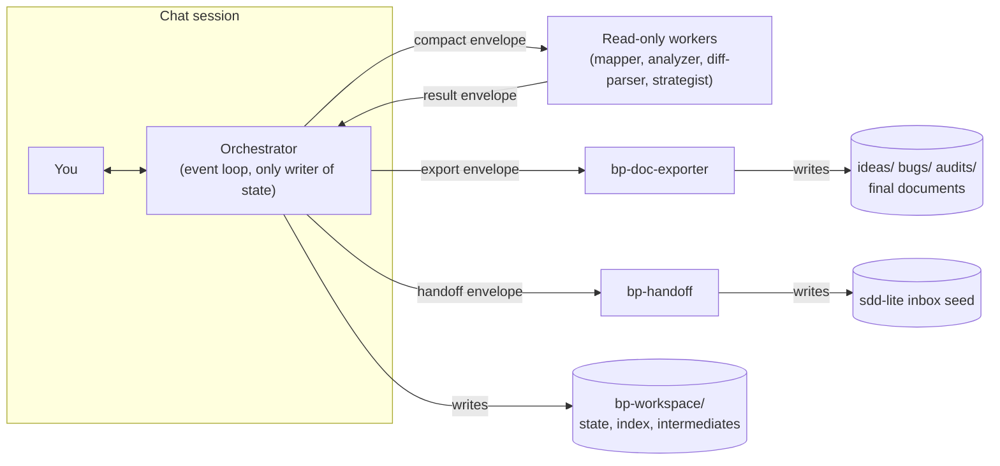
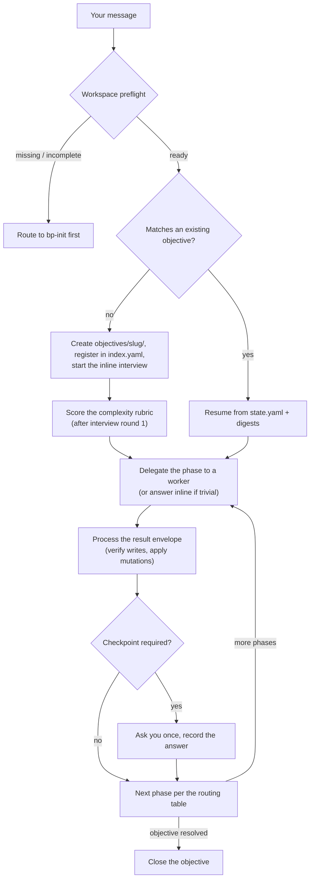
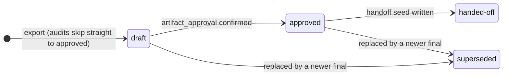
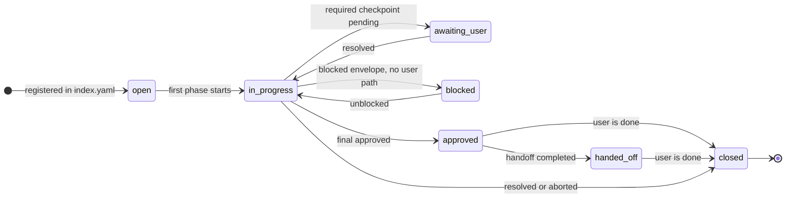

# How blueprint-harness works

The engine mechanics in plain language: what runs where, what gets written when, and why the system behaves the way it does. For day-to-day usage (install, config reference, examples) see [`../USER-GUIDE.md`](../USER-GUIDE.md); for design rationale see [`../blueprint-spec.md`](../blueprint-spec.md). At runtime the engine files are normative — this document explains them, it never overrides them.

---

## Table of contents

1. [The big picture](#1-the-big-picture)
2. [The session loop](#2-the-session-loop)
3. [State and resume](#3-state-and-resume)
4. [Workers and envelopes](#4-workers-and-envelopes)
5. [Checkpoints](#5-checkpoints)
6. [Rigor and complexity](#6-rigor-and-complexity)
7. [Read-only guarantees](#7-read-only-guarantees)
8. [Summary](#8-summary)

---

## 1. The big picture

Three moving parts:

- **The orchestrator** (`orchestrator/BP-ORCHESTRATOR.md`) — a thin event loop. It routes requests, runs interviews itself, assembles compact instructions for workers, processes their results, and is the **only writer** of state. It never explores the repo broadly on its own.
- **The workers** — the `bp-*` skills. Each executes exactly one phase under a hard budget and returns one structured result. Four are strictly read-only; two write a single owned artifact each; one installs the harness.
- **The shared contracts** (`skills/_shared/`) — the rulebook. Every rule lives in exactly one file; the orchestrator and the skills reference it in one line instead of restating it.

Three places on disk:

| Place | What lives there | Who writes it |
|---|---|---|
| `.bp-harness/` | versioned engine copy — normative at runtime | `bp-init` only |
| `bp-workspace/` | everything durable: config, state, intermediates, finals, your templates | orchestrator + `bp-doc-exporter` |
| `.claude/skills/` / `.agents/skills/` | the skill copies your AI platform actually loads | `bp-init` only |

**Why single-source matters:** every rule stated once and referenced keeps a worker launch at roughly 1,000–1,200 tokens of instructions, and means a rule can never drift into two contradictory versions. When two files seem to disagree, one of them is a reference and the contract wins.

## 2. The session loop

What happens between your message and the next phase:

Step by step:

1. **Preflight** — before any flow: `ready` continues; `stale` (engine version mismatch) warns once and offers an update; `missing`/`incomplete` routes to `bp-init` — no flow may start on a broken workspace.
2. **Mode, asked once** — first blueprint request of the session: `interactive` (pause after each phase for your OK) or `auto` (chain phases, stop only at required checkpoints and blocks). Cached for the whole session.
3. **Routing** — the request is normalized against persisted evidence (never chat memory) and matched to a routing-table row. The table is the authority; a worker's suggestion is only a signal.
4. **Interview** — run by the orchestrator itself, in chat. There is no interviewer worker (see [flows §6](02-flows.md#6-interviews)).
5. **Delegation** — one worker per phase, never per file. The orchestrator reads 1–3 files inline when that settles a decision; at 4+ files it must delegate (the **4-file rule**). After 15 tool calls without delegating it must stop and reconsider (the **long-session rule**).
6. **Result processing** — a fixed 7-step protocol on every returned envelope; the first step is verifying the worker wrote nothing it doesn't own (see [§4](#4-workers-and-envelopes)).
7. **Phase close** — at the close of interview, analysis, and strategy the orchestrator persists state and digests, then suggests compacting the chat. Everything needed to continue survives on disk; chat history is disposable.

## 3. State and resume

Everything durable lives in `bp-workspace/` (full layout in [USER-GUIDE §6](../USER-GUIDE.md#6-runtime-file-layout)). The mechanics:

- **`index.yaml`** — one line per objective (slug, type, lifecycle status, one-line digest). The entry point for every resume.
- **`objectives/{slug}/state.yaml`** — the objective's full record: phases, checkpoints, decisions, artifact pointers. One folder per objective, so parallel objectives never touch each other.
- **Digests** — every artifact opens with a `## <Name> Digest` block of 3–6 flat fields (`status`, `objective`, `updated`, `summary`). The system reads digests before bodies — that is what makes resume cheap.

**Resume ladder** (never chat memory): `index.yaml` → the objective's `state.yaml` → artifact digests. If state and digests disagree, **digests win** and state is repaired. Work resumes at the first unresolved item: unresolved checkpoint → missing/stale artifact → recorded `next_action`.

Two small state machines drive everything. Final artifacts:

Objectives:

Every status change goes through the orchestrator (objective status) or a `bp-doc-exporter` `update-status` call it routes (artifact status). Note the two enums differ on purpose: objective status is snake_case (`handed_off`), artifact digest status uses hyphens (`handed-off`).

## 4. Workers and envelopes

A worker is a fresh sub-agent that knows nothing except what its **envelope** says. The envelope contains: the skill id, the objective (slug, type, phase), the rigor level with its budget row, the approved scope, artifact paths **plus digests** (never bodies), relevant `key_files`, and the verbatim execution boundary. Keeping bodies out of envelopes is what keeps launches cheap.

The boundary, included verbatim in every delegation:

> You are a phase executor. Work read-only. Do NOT write any file, do NOT launch sub-agents, do NOT orchestrate further steps. Complete your phase and return the result envelope.

For the writer skills (`bp-doc-exporter`, `bp-handoff`, `bp-init`) the write clause becomes: *"Write ONLY the owned path(s) named in this envelope."*

Every worker ends with one **result envelope**: `status` (`success`/`partial`/`blocked`), a ≤ 3-line `executive_summary`, `artifacts` (files written — `[]` for read-only workers), `next_action`, `open_risks`, plus optional fields (`findings`, `state_mutations`, `user_message`, …). `partial` means useful output with declared gaps; `blocked` means a named precondition is missing. Workers never write state — they *propose* `state_mutations` and the orchestrator applies them after verifying the envelope.

Hard read budgets, per worker:

| Worker | Budget |
|---|---|
| `bp-context-mapper` | ≤ 6 file reads, single pass (listings and greps are free) |
| `bp-analyzer` | per rigor: `light` ≤ 4 files · `standard` ≤ 8 · `deep` ≤ 15 |
| `bp-diff-parser` | ≤ 20 commits or one ref range per invocation |
| `bp-strategist` | works from provided evidence; ≤ 3 verification reads |

Exhausted budget → the worker returns `partial` with what remains, never widens silently. Word budgets for what gets persisted are equally hard (see [USER-GUIDE §6](../USER-GUIDE.md#6-runtime-file-layout)).

**The incident rule:** step 1 of result processing checks `artifacts`. A read-only worker that reports *any* written file — or a writer skill that touched a path it doesn't own — is an incident: the session stops, the write is audited, and the output is distrusted.

## 5. Checkpoints

All user interaction is typed. Seven checkpoint types, three behaviors:

| Behavior | Types | Meaning |
|---|---|---|
| **Required** — block until you answer, in every mode | `missing_context`, `scope_change`, `artifact_approval`, `handoff_gate` | scope, direction, or approval decisions; `auto` mode never skips these |
| **Smart-skippable** | `phase_validation` | skipped and recorded as implicitly approved when you already answered or said "proceed" — but never while ambiguity or a risk above `medium` remains |
| **Offer-once** | `audit_persist_offer`, `deep_interview_suggestion` | made exactly once, never block progress, the answer is recorded as a decision |

Every checkpoint has the same shape: short summary + one concrete question + 2–4 options with one recommended + free-form allowed. Every resolution persists to `state.yaml` — **a resolved checkpoint is never re-asked**, including across sessions.

## 6. Rigor and complexity

Two dials set analysis depth:

**Rigor** (`rigor_level` in `config.yaml`) is a repo-wide setting: how much evidence is required and how much reading is allowed. The full table (budgets, alternatives count, root-cause evidence bar) is in [USER-GUIDE §5](../USER-GUIDE.md#5-the-configyaml-file); the single source is `skills/_shared/bp-flow-contract.md`.

**Complexity** is scored per objective, once, when the first interview round closes — three dimensions, 0–2 points each:

| Dimension | 0 | 1 | 2 |
|---|---|---|---|
| Estimated surface (modules/dirs involved) | 1 | 2–3 | ≥ 4 |
| Material questions unresolved after round 1 | 0 | 1–2 | ≥ 3 |
| Cross-cutting concerns (auth, data model, external integrations) | 0 | 1 | ≥ 2 |

| Total | Band | Effect |
|---|---|---|
| 0–2 | `simple` | analyzer uses the `light` budget regardless of configured rigor |
| 3–4 | `standard` | normal flow at the configured rigor |
| 5–6 | `complex` | raises `deep_interview_suggestion` (proactively at `deep` rigor, never at `light`) |

So rigor sets the ceiling and complexity can lower spend below it — a trivial bug at `deep` rigor still gets a small analysis. The score is recorded as a decision (e.g. `complexity: standard (2+1+1)`), so it is auditable later.

## 7. Read-only guarantees

Blueprint never modifies source code, git state, or sdd-lite (beyond the one inbox seed). Three independent layers enforce it — platform permissions (mechanical), the envelope boundary (instructional), and post-worker write verification (detective, the incident rule from [§4](#4-workers-and-envelopes)). Details and the recommended permission set: [USER-GUIDE §9](../USER-GUIDE.md#9-how-read-only-is-enforced).

Git specifically: only `log`, `show`, `diff`, `status`, `blame` are permitted. There are **no git mutations, with no exceptions** — no staging, commits, tags, or pushes, ever.

## 8. Summary

- Three parts: a thin **orchestrator** (routes, interviews, only writer of state), budgeted **workers** (one phase each, read-only except two single-artifact writers), and **shared contracts** (each rule in exactly one file).
- Three disk areas: `.bp-harness/` (engine, `bp-init` only), `bp-workspace/` (everything durable), skill copies in `.claude/`/`.agents/` (`bp-init` only).
- The loop per message: preflight → route from persisted evidence → interview inline → delegate one worker per phase → process the result in 7 fixed steps → checkpoint → next row in the routing table.
- Delegation triggers: 4+ files to read → delegate (4-file rule); 15 tool calls without delegating → reconsider; any unexpected mutation → stop and audit.
- Resume reads `index.yaml` → `state.yaml` → digests, never chat memory; digests beat state; work restarts at the first unresolved item.
- Artifact lifecycle `draft → approved → handed-off | superseded` (audits born `approved`); objective lifecycle `open → in_progress ↔ awaiting_user → approved → handed_off → closed`, with `blocked` as a side state.
- Envelopes carry paths + digests, never bodies; workers return one structured result and *propose* state mutations — the orchestrator applies them.
- Budgets are hard: mapper ≤ 6 files, analyzer 4/8/15 by rigor, diff-parser ≤ 20 commits, strategist ≤ 3 verification reads; over budget → `partial`, never silent widening.
- Checkpoints: 4 required, 1 smart-skippable, 2 offer-once; all persisted; never re-asked.
- Rigor (config) sets the ceiling; the per-objective complexity band (3 × 0–2 rubric) can lower spend or suggest a deep interview.
- Read-only is enforced three ways; a worker that writes what it doesn't own is an incident that stops the session.
