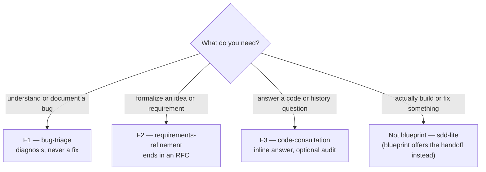
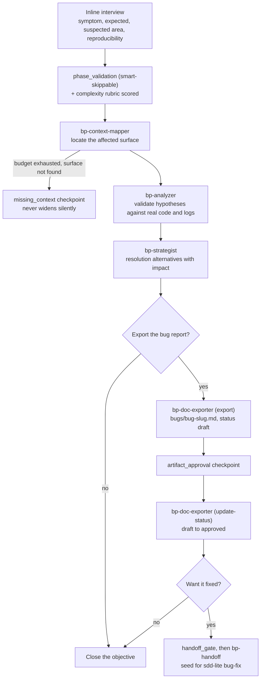
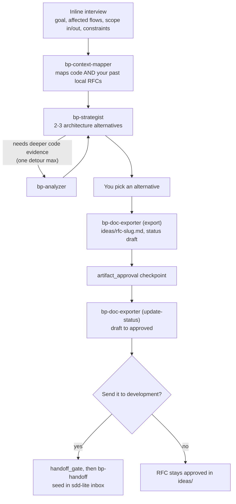
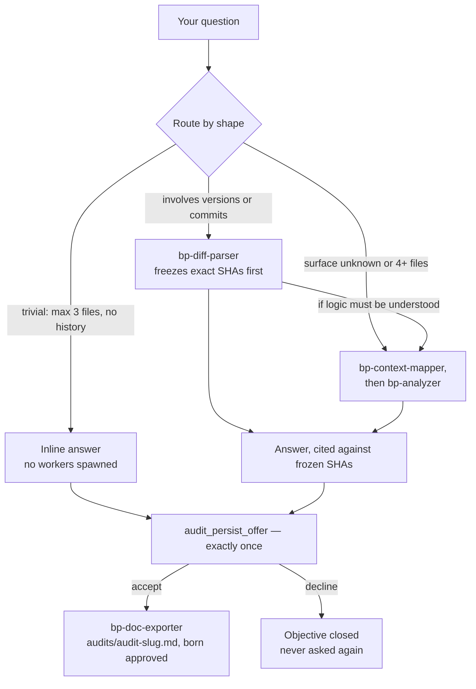
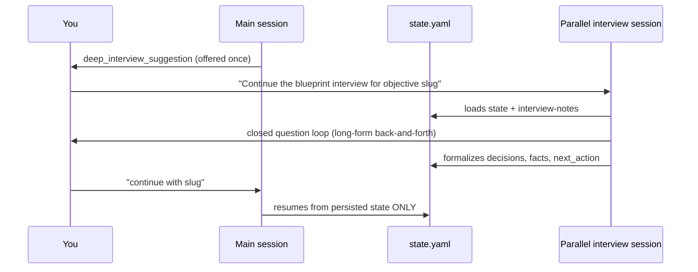
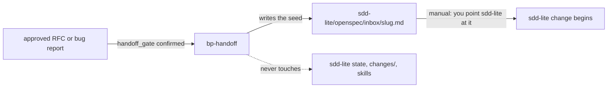

# The flows, step by step

What actually happens in each of the three flows: phases, workers, checkpoints, and what you get at the end. Engine mechanics (envelopes, budgets, state) are in [`01-how-it-works.md`](01-how-it-works.md); usage dialogues in [USER-GUIDE §10](../USER-GUIDE.md#10-usage-examples). The routing tables in `orchestrator/BP-ORCHESTRATOR.md` are the runtime authority.

---

## Table of contents

1. [Choosing a flow](#1-choosing-a-flow)
2. [The common skeleton](#2-the-common-skeleton)
3. [F1 — bug-triage](#3-f1--bug-triage)
4. [F2 — requirements-refinement](#4-f2--requirements-refinement)
5. [F3 — code-consultation](#5-f3--code-consultation)
6. [Interviews](#6-interviews)
7. [Handoff to sdd-lite](#7-handoff-to-sdd-lite)
8. [Resume and concurrency](#8-resume-and-concurrency)
9. [Summary](#9-summary)

---

## 1. Choosing a flow

You don't name the flow — you say what you need and the orchestrator routes:

Two routing rules worth knowing:

- **The bug rule** — "I have a bug" is ambiguous: blueprint `bug-triage` when you want *understanding or a documented diagnosis*; sdd-lite `bug-fix` when you want *it fixed*. When in doubt, triage first — it hands off cleanly into a fix.
- **The trivial path** — a question answerable from ≤ 3 files with no history involved is answered inline in chat, no workers, no objective ceremony beyond registration.

## 2. The common skeleton

F1 and F2 share the same skeleton; F3 is deliberately lighter. Each phase produces one persisted piece:

| Phase | Executed by | Produces |
|---|---|---|
| `interview` | orchestrator, in chat | `interview-notes.md` + complexity score |
| `context_mapping` | `bp-context-mapper` | surface map, `key_files` (into state) |
| `analysis` / `history` | `bp-analyzer` / `bp-diff-parser` | `analysis.md` (facts / inferences / unknowns) |
| `strategy` | `bp-strategist` | `alternatives.md` (options + one recommendation) |
| `export` | `bp-doc-exporter` | the final document (`draft`) |
| `handoff` | `bp-handoff` | the sdd-lite inbox seed |

Session mode shapes the pace, not the path: **`interactive`** pauses after each phase with a 3–5 line summary; **`auto`** chains phases and stops only at required checkpoints, blocks, and risks above `low`. At the close of interview, analysis, and strategy the orchestrator persists everything and suggests compacting the chat — you can kill the session at any point and resume later.

## 3. F1 — bug-triage

From symptom to an evidence-backed diagnosis with resolution options:

Flow-specific behavior:

- The analyzer works from **log files or text you paste** — nothing is ever executed to obtain evidence.
- Root cause respects the rigor evidence bar: at `deep` rigor only deterministic evidence may assert a cause; anything weaker is labeled inference or `unknown`.
- The bug report's digest `severity` comes from the highest confirmed analysis finding — the orchestrator passes it to the exporter, which is forbidden to infer it.

## 4. F2 — requirements-refinement

From loose idea to a reviewed RFC, optionally handed to development:

Flow-specific behavior:

- Mapping contrasts the new idea against **existing workspace artifacts** (`ideas/`, `bugs/`, `audits/` digests) so a new proposal doesn't silently contradict a decision you already recorded — overlaps are flagged, and the strategist flags any alternative that contradicts a prior artifact.
- F2 goes interview → strategy directly; the analyzer only enters as a one-time detour when the strategist needs a specific feasibility claim verified.
- If a new RFC replaces an older one for the same objective, the old final is flipped to `superseded` — nothing is deleted.

## 5. F3 — code-consultation

The lightweight path — most consultations end in chat:

Flow-specific behavior:

- History questions are **frozen before analysis**: the diff-parser resolves refs to exact SHAs and every later claim cites them — the answer can't drift with the branch.
- The audit offer is `offer-once`: accept and the audit is written born `approved` (accepting *is* the approval); decline and that objective never asks again.

## 6. Interviews

Interviews are run by the orchestrator in chat — there is no interviewer worker.

**Inline interview** (every flow starts here): max 3 questions per round, max 2 rounds. Each flow has a completeness rubric — what must be known before analysis may start:

| Flow | Must be known |
|---|---|
| `bug-triage` | observed symptom · expected behavior · suspected area or trigger · reproducibility (known or explicitly unknown) |
| `requirements-refinement` | business goal · affected users/flows · scope boundaries (in/out) · known constraints |
| `code-consultation` | the concrete question · version/commit scope if historical |

**Smart skip** applies: facts already in `config.yaml`, state, or your opening message are never asked. Dump a full spec upfront and the interview may collapse to zero or one follow-up. If two rounds pass and the rubric still has gaps, the flow raises `missing_context` rather than guessing.

**Deep interview** — when the complexity rubric scores `complex` (or you ask for it), the orchestrator suggests a dedicated parallel session, once:

The key property: the main session never reads the other session's chat — only what was formalized into state. If the deep interview didn't finish, the main session sees that in state and offers to continue inline.

## 7. Handoff to sdd-lite

The only bridge between discovery and implementation, deliberately passive:

The sequence: artifact must be `approved` → you confirm the `handoff_gate` → `bp-handoff` writes a **self-contained seed** (problem, scope sketch, feasibility signal, open questions — readable without access to `bp-workspace/`) → on success the source artifact is flipped `approved → handed-off`. If sdd-lite isn't installed, the handoff blocks with a clear message and writes nothing.

One-way rule: once development starts, scope changes live in sdd-lite's artifacts. Blueprint doesn't re-edit a handed-off RFC — if discovery genuinely reopens, that's a new objective.

## 8. Resume and concurrency

- **Resume**: in any new session, "continue with {slug}" (or an unambiguous reference) resolves the objective via `index.yaml`, loads its `state.yaml`, validates it against digests (digests win), and picks up at the first unresolved item — unresolved checkpoint first, then missing/stale artifacts, then the recorded `next_action`. No chat memory involved.
- **Concurrency**: every objective owns its folder and state. Asking a quick F3 question while an F2 RFC sits at `awaiting_user` touches nothing in the F2 folder. Switching the *type* of an existing objective mid-flow is never silent — it raises a `scope_change` checkpoint (close it, or spawn a new objective).
- **Aborting**: say you're done and the objective is closed (`lifecycle_status: closed`) after one confirmation; intermediates stay on disk for the record.

## 9. Summary

- You never name the flow — routing infers it: bug understanding → **F1**, formalize an idea → **F2**, code/history question → **F3**, "build it" → handoff to sdd-lite.
- F1: interview → map → analyze → strategize → optional export (`draft`) → your approval (`approved`) → optional handoff. Severity comes from confirmed findings; logs are read, never executed.
- F2: interview → map (code **and** your past RFCs) → alternatives (analyzer only as a one-time detour) → you pick → export → approval → optional handoff. Old finals become `superseded`, never deleted.
- F3: trivial → inline answer with zero workers; history → SHAs frozen first; either way one `audit_persist_offer`, and audits are born `approved`.
- Interviews: inline, max 3 × 2, smart-skipped when you already gave the facts; gaps after round 2 → `missing_context`. Complex topics get a one-time deep-interview suggestion in a parallel session that talks to the main one **only through persisted state**.
- Handoff: `approved` artifact + confirmed `handoff_gate` → one self-contained seed in `sdd-lite/openspec/inbox/`; consumption is manual; blueprint never modifies sdd-lite; the transition is one-way.
- Everything resumes from `index.yaml` → `state.yaml` → digests; objectives are isolated so quick questions never disturb open work.
