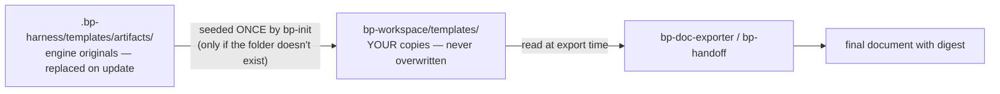

# Skills, templates, and customization

What each skill actually does, how templates turn evidence into documents, and exactly what you can (and can't) customize. Mechanics of envelopes and budgets: [`01-how-it-works.md`](01-how-it-works.md); when each skill runs: [`02-flows.md`](02-flows.md).

---

## Table of contents

1. [How skills fit in](#1-how-skills-fit-in)
2. [The 7 skills](#2-the-7-skills)
3. [The shared contracts](#3-the-shared-contracts)
4. [Templates](#4-templates)
5. [Customizing a template](#5-customizing-a-template)
6. [Customizing config.yaml](#6-customizing-configyaml)
7. [What NOT to customize](#7-what-not-to-customize)
8. [Summary](#8-summary)

---

## 1. How skills fit in

You never invoke a `bp-*` skill directly — the orchestrator routes to them from its routing tables, one skill per phase. Each skill is a self-contained `SKILL.md` (under 150 lines) that a fresh sub-agent executes with only its envelope for context.

Each skill exists in two places, on purpose:

| Copy | Path | Role |
|---|---|---|
| Engine source | `.bp-harness/skills/bp-*/` | the versioned original; replaced wholesale on update |
| Platform copy | `.claude/skills/bp-*/` and/or `.agents/skills/bp-*/` | what your AI platform actually loads; refreshed from the engine on every `bp-init` update |

Editing a platform copy therefore doesn't survive an update — customization happens in `bp-workspace/` (templates, config), never in skill files.

## 2. The 7 skills

Grouped by what they're allowed to write:

**Readers — write nothing, ever** (`artifacts: []` in every result):

| Skill | Phase | What it does | Hard budget |
|---|---|---|---|
| `bp-context-mapper` | `context_mapping` | locates the relevant surface (files, modules, entry points) and checks your past workspace artifacts for overlaps; proposes `key_files` | ≤ 6 file reads, single pass |
| `bp-analyzer` | `analysis` | reads the internal logic, validates hypotheses, returns findings classified `fact`/`inference`/`unknown` with `file:line` proof; never executes anything | 4 / 8 / 15 files by rigor |
| `bp-diff-parser` | `history` | freezes exact SHAs, then summarizes what changed (files, signatures) without dumping diffs; git read commands only | ≤ 20 commits per invocation |
| `bp-strategist` | `strategy` | turns the accumulated evidence into 2–3 architecture-level alternatives with risks, S/M/L effort, and exactly one recommendation | evidence-only + ≤ 3 verification reads |

**Writers — one owned path each, named in the envelope:**

| Skill | Phase | Writes | Notes |
|---|---|---|---|
| `bp-doc-exporter` | `export` | one final in `ideas/`, `bugs/`, or `audits/` | two modes: `export` (fill your template from the intermediates) and `update-status` (flip only the digest `status` line after a checkpoint). Fills only sections that exist in your template; a section with no source content states "Not established" — it never invents |
| `bp-handoff` | `handoff` | one seed in `./sdd-lite/openspec/inbox/` | requires an `approved` source and a resolved `handoff_gate`; never reads `state.yaml` itself and never touches sdd-lite beyond the seed |

**Installer:**

| Skill | Writes | Notes |
|---|---|---|
| `bp-init` | `.bp-harness/`, `bp-workspace/` skeleton + config, skill copies, wrapper blocks (confirmed), permission settings (confirmed) | install, update, repair; asks at most 2 questions; never touches `.gitignore` or existing `bp-workspace/templates/` (details: [USER-GUIDE §4](../USER-GUIDE.md#4-setup-bp-init)) |

## 3. The shared contracts

`skills/_shared/` is the rulebook — each rule lives in exactly one file, and the orchestrator and skills reference it instead of restating it:

| File | Single source for |
|---|---|
| `bp-flow-contract.md` | canonical ids (flows, skills, phases) · result envelope shape · worker execution boundary · rigor-level table · flow and resume rules |
| `bp-persistence-contract.md` | workspace layout · the write-ownership table (who may write each path) · digest format · artifact lifecycle · word budgets |
| `bp-findings-contract.md` | the finding row (`fact`/`inference`/`unknown`, evidence class, proof refs) · severity scale · precision gate ("silence over speculation") |
| `bp-user-interaction-contract.md` | the 7 checkpoint types and their behaviors · checkpoint shape · smart-skip and offer-once rules |
| `sdd-lite-mapping.md` | how blueprint relates to sdd-lite (vocabulary, boundaries, the handoff) |

If a skill and a contract ever seem to disagree, the contract wins — the skill line is a reference to it.

## 4. Templates

Every document blueprint produces is a filled template. The catalog (`templates/` in the package, mirrored in `.bp-harness/templates/`):

| Group | Files | Filled by | Where the output goes |
|---|---|---|---|
| Intermediates | `interview-notes.md`, `analysis.md`, `alternatives.md` | orchestrator, at phase close | `objectives/{slug}/` |
| Finals | `rfc.md`, `bug-report.md`, `audit.md` | `bp-doc-exporter` | `ideas/`, `bugs/`, `audits/` |
| Handoff | `handoff-seed.md` | `bp-handoff` | `sdd-lite/openspec/inbox/` |
| Bootstrap | `bootstrap/config.yaml` | `bp-init`, once | `bp-workspace/config.yaml` |
| Wrappers | `wrappers/claude-orchestrator.md`, `wrappers/agents-orchestrator.md` | `bp-init`, into marker blocks | `CLAUDE.md` / `AGENTS.md` |

The artifact templates exist in **two copies**, and the distinction is the whole customization story:

At export time the exporter reads **your** copy, fills only the sections that exist in it, sources content exclusively from the objective's intermediates and recorded decisions, writes the digest, and trims to the word budget. Anatomy of a template (e.g. `rfc.md`): an HTML comment header stating budget and owner, the `## <Name> Digest` block, then plain markdown sections with `<angle-bracket>` guidance placeholders.

## 5. Customizing a template

Want RFCs with your team's sections? Edit `bp-workspace/templates/rfc.md`. The rules:

1. **Edit the copy in `bp-workspace/templates/`** — never the one in `.bp-harness/` (an update would silently revert it).
2. **Keep the digest block first**, with its flat fields (`status`, `objective`, `updated`, `summary`). Routing and resume read digests before bodies; removing it breaks resume for that artifact type.
3. **Sections are yours**: rename, reorder, remove, or add freely. The exporter fills only what exists — a section it has no source content for gets "Not established", never invented text. If you add a section no phase produces evidence for, expect it to stay "Not established".
4. **Budgets still apply** — the word budget belongs to the artifact type (RFC 400–800, bug report 300–600, audit 200–400, seed 200–400), not to the template. More sections within the same budget means less depth per section.
5. **Your edits survive updates** — `bp-init` seeds `bp-workspace/templates/` only when the folder doesn't exist and never overwrites it afterwards, in any mode.
6. **To reset one template**, copy the pristine version back by hand from `.bp-harness/templates/artifacts/`.

Good customizations: adding a "Rollout plan" section to `rfc.md`, renaming sections to your team's RFC vocabulary, trimming `audit.md` to two sections. Bad customizations: deleting the digest, adding sections that demand new analysis (the workers don't read your templates — evidence collection doesn't change), padding the template hoping for longer output (the budget caps it).

## 6. Customizing config.yaml

`bp-workspace/config.yaml` is yours to edit (validated against `schemas/bp-config.schema.yaml`; full reference in [USER-GUIDE §5](../USER-GUIDE.md#5-the-configyaml-file)):

| Field | Edit it to… |
|---|---|
| `product.name` / `product.domain` | give interviews and mappings real business context — the defaults are placeholders and worth replacing |
| `product.glossary` | fix domain vocabulary the harness should use consistently |
| `rigor_level` | move the depth dial (`light` / `standard` / `deep`) for the whole repo |
| `conventions.chat_language` | `es` or `en` for conversation |

Leave to the system: `conventions.persisted_language` (always `en`, keeps handoffs compatible), `capabilities` and `engine.*` (maintained by `bp-init`), `sdd_lite_integration` (detected).

## 7. What NOT to customize

| Don't touch | Why |
|---|---|
| Anything under `.bp-harness/` | it's the engine copy — replaced wholesale on every update |
| Skill copies in `.claude/skills/` / `.agents/skills/` | refreshed from the engine on every update; edits vanish |
| `state.yaml`, `index.yaml` | the orchestrator is their only writer; hand edits break resume and routing |
| The wrapper block between `<!-- bp-harness:start -->` / `<!-- bp-harness:end -->` | regenerated on update; edits inside the markers are lost (text *outside* the markers is untouched) |
| Objective intermediates (`objectives/{slug}/*.md`) | orchestrator-owned records of what was actually established; edit the final instead, or reopen the phase |

Your entire customization surface, by design: `bp-workspace/templates/` and `bp-workspace/config.yaml`.

## 8. Summary

- Skills are routed by the orchestrator, never invoked by you; each lives twice — engine original in `.bp-harness/`, loaded copy in `.claude/`/`.agents/` — and both belong to the update cycle, so skills are not a customization surface.
- 4 readers (`mapper` ≤ 6 files, `analyzer` 4/8/15 by rigor, `diff-parser` ≤ 20 commits, `strategist` evidence-only + 3 reads) write nothing; 2 writers own exactly one path each (`bp-doc-exporter` → finals, `bp-handoff` → the seed); `bp-init` owns setup.
- The exporter has two modes: `export` (fill your template) and `update-status` (flip a digest status after a checkpoint) — it never invents content; unsourced sections say "Not established".
- Five `_shared/` contracts are the single source for vocabulary, envelopes, persistence/ownership, findings, and checkpoints; on any apparent conflict, the contract wins.
- Templates: engine originals are seeded **once** into `bp-workspace/templates/`, which is yours and never overwritten; the exporter reads your copy at export time.
- Customize freely: sections (rename/reorder/add/remove), wording, `config.yaml` identity/glossary/rigor/chat language. Keep: the digest block first, and the word budget in mind. Reset by copying from `.bp-harness/templates/artifacts/`.
- Never hand-edit: `.bp-harness/`, skill copies, `state.yaml`/`index.yaml`, wrapper marker blocks, objective intermediates.
