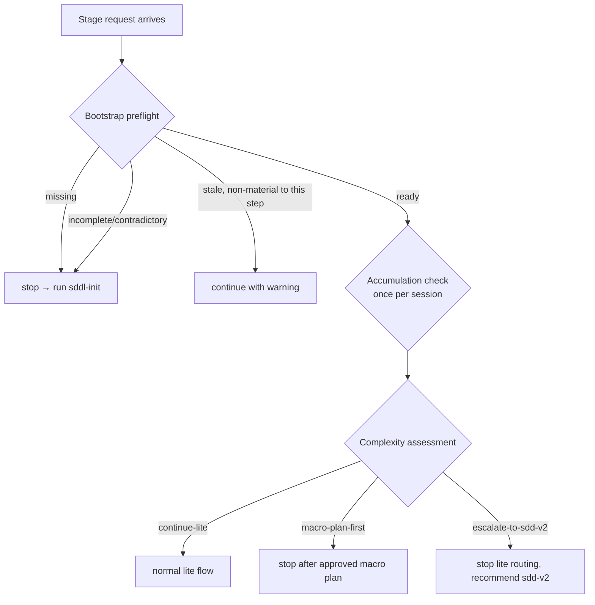

# sdd-lite — Orchestrator

Other docs: [architecture.md](./architecture.md) · [flow.md](./flow.md) · [skills.md](./skills.md) · [review-protocols.md](./review-protocols.md) · [config-and-state.md](./config-and-state.md)

How `SDDL-ORCHESTRATOR.md` decides what runs next. For the three-layer architecture this fits into, see [architecture.md](./architecture.md). For the full stage-by-stage flow, see [flow.md](./flow.md).

## Session initialization

On the first sdd-lite stage request in a session, the orchestrator asks once for an execution mode and caches it:

- `interactive` (default) — pause after each successful stage, show a 3-5 line summary, wait for an explicit confirmation phrase (`yes`, `continue`, `sigue`, `dale`, `ok`, `listo`, `proceed`, `go`, `siguiente`, `next`, `adelante`) before routing onward.
- `auto` — chain stages without pausing, but still surface `blocked`/`partial` results, medium+ risks, escalation decisions, and every mandatory approval gate.

Neither mode grants permission to skip `stage_approval` or any other mandatory checkpoint — they only control pacing.

## Bootstrap preflight

Before any change routing, the orchestrator checks for three required files: `./sdd-lite/openspec/config.yaml`, `./sdd-lite/project-context.md`, `./sdd-lite/skill-catalog.md`.

`stale` bootstrap may continue for formalization or resume when the stale risk does not change route, scope, or file targets — but code-touching execution must not start until the stale signal is accepted as non-material or bootstrap is refreshed.

## Accumulation check

Runs once per session, right after preflight passes (there is no end-of-session event to hook instead):

1. Glob `./sdd-lite/openspec/changes/*/` and count entries (`archive/` is a sibling, never counted here).
2. Below `archive.suggest_threshold` (default 15, see [config-and-state.md](./config-and-state.md)) → say nothing.
3. At or above: read only `lifecycle_status` and `updated_at` per `state.yaml`, count the archivable ones (`completed`, `planned`, or stale `draft`/`planning`).
4. If that archivable count clears the threshold, offer `sddl-archive` in one line and continue with the user's actual request regardless of the answer.

The offer never repeats once declined or ignored in a session, and never blocks the user's request.

## Complexity assessment

An orchestration decision, not a stage artifact. Evaluated at least on: scope span, ambiguity, blast radius, execution depth, risk profile.

| Route | Use when | Result |
|---|---|---|
| `continue-lite` | bounded enough for normal staged execution | continue through the canonical flow |
| `macro-plan-first` | still fits lite but must be decomposed before execution is safe | stop after an approved macro plan |
| `escalate-to-sdd-v2` | exceeds lite safety, governance, or complexity limits | stop lite routing, recommend `sdd-v2` |

## Delegation rules

Core test: *does this inflate orchestrator context without need?* If yes, delegate.

| Action | Inline | Delegate |
|---|---|---|
| Read to decide/verify (1-3 files) | yes | — |
| Read to explore/understand (4+ files) | — | yes |
| Read as preparation for writing | — | yes, with the write |
| Write atomic (one file, already known) | yes | — |
| Write with analysis (multiple files, new logic) | — | yes |
| Bash for state (`git status`, file checks) | yes | — |
| Bash for execution (test, build, install) | — | yes |

Default stage delegation: `sddl-proposal`, `sddl-spec`, `sddl-design`, `sddl-plan`, `sddl-executor`, `sddl-qa-review`, `sddl-delivery`, `sddl-archive` always run as fresh workers. Delegation happens per phase or per approved execution stage — never per file.

**Mandatory triggers** (fire → delegate, or explicitly justify inline handling to the user):

1. **4-file read rule** — understanding needs 4+ repo files → `sddl-deep-explorer` or the relevant stage worker.
2. **Multi-file write rule** — implementation touches 2+ non-trivial files → `sddl-executor` or the relevant stage worker; never inline.
3. **Long-session rule** — 15 tool calls or 5 exploratory reads without a delegation → pause and reassess.
4. **Incident rule** — wrong directory, accidental mutation, confusing state, unexpected error → stop, audit, delegate a fresh worker if material.
5. **Fresh review rule** — adversarial review of diffs/conflicts/incidents always runs in fresh context; never review your own deep work inline.

Anti-patterns that always inflate context: 5+ inline reads to dodge a delegation, inline multi-file edits, inline builds/tests/installs, reviewing your own work, continuing past an incident without an audit, delegating per file instead of per phase. Per-dimension review fan-out (one worker per lens/judge on the same frozen target) is explicitly *not* this anti-pattern.

## Worker handoff envelope

Every delegated stage receives a compact envelope: stage id, `change_name`, objective, selected route, approved scope (or the blocked question), artifact paths, short artifact digests, the `## Project Standards (auto-resolved)` block copied from `skill-catalog.md`, and the fixed **execution boundary** instruction:

> You are a phase executor. Do NOT launch sub-agents, do NOT call Task tools, do NOT orchestrate further stages. Complete your phase work and return the result contract.

Expected result fields: `status`, `executive_summary`, `artifacts`, `next_action`, `open_risks`, `context_resolution`, `standards_source`, `artifact_digests_used`, `recommended_next_stage`. Full field semantics live in `skills/_shared/sddl-flow-contract.md`.

Review workers (lenses, judges, refuter) get an extension of this envelope — see [review-protocols.md](./review-protocols.md).

## Result processing protocol

When a worker returns, the orchestrator processes it in this fixed order before routing further:

1. **Check `status`** — `success`: validate against approved scope, route onward. `partial`: surface `decision_required`/`decision_options`, wait. `blocked`: surface the reason immediately, never work around it.
2. **Ingest `findings`** (review workers only) — merge into `review-ledger.md` per `skills/_shared/sddl-review-ledger-contract.md`; only the orchestrator writes it. A worker that wrote any file is an incident: stop, audit, distrust its findings.
3. **Check `context_resolution`** — `fallback_registry`/`fallback_path`/`none` means the standards injection was lost; re-resolve from `skill-catalog.md` before the next delegation.
4. **Check `open_risks`** — critical/high/medium: surface before routing on. Low: carry forward with a visible note, no acknowledgment required.
5. **Validate `recommended_next_stage`** — cross-check against the Stage Routing Table below; the worker's recommendation is a signal, never an override.
6. **Show a phase summary** — what was produced, current lifecycle status, the next step, in 3-5 lines. Wait for confirmation in `interactive` mode; route immediately in `auto`.

## Closeout offer

The moment `sddl-qa-review` final mode marks a change `completed`, present delivery and archive together, once:

> Change `{change-name}` is completed (QA: `{verdict}`).
> 1. Draft the delivery — `sddl-delivery`
> 2. Archive it — `sddl-archive`
> 3. Both, delivery first (recommended)
> 4. Neither, leave it in `changes/`

On `both`, delivery runs first so `delivery-report.md` lands inside `changes/{change-name}/` and archives with the change in one folder. Declining either never blocks the other or the user's next request; a resolved `neither` is not asked again.

## Stage routing table

| Situation | Next stage/action | Approval | Notes |
|---|---|---|---|
| bootstrap `missing`/`incomplete` | `sddl-init` | no | no change stage may start |
| bootstrap `stale`, non-material | continue with warning | no | refresh before risky execution |
| route unclear, needs bounded evidence | `sddl-deep-explorer` | yes | read-only, returns to the blocked point |
| no active change artifact | `sddl-proposal` | yes | normal entry stage |
| `proposal.md` missing/stale/contradicted | `sddl-proposal` | yes | |
| proposal usable with `proposal_status: ready`, `spec.md` missing/outdated | `sddl-spec` | yes | |
| `proposal.md` exists, `proposal_status` is `needs-input`/`blocked` | `sddl-proposal` | yes | resolve the open readiness gate first |
| spec usable, `design.md` missing/outdated | `sddl-design` | yes | |
| design usable, `plan.md` missing/outdated | `sddl-plan` | yes | |
| objective `planner`, plan complete | stop, `lifecycle_status: planned` | no | never auto-routes to execution/QA |
| `macro-plan-first`, macro-plan not approved | `macro_plan_review` checkpoint | no | do not write `macro-plan.md` before approval |
| `macro-plan-first`, approved | `sddl-plan` | yes | owns `macro-plan.md` |
| implementation ready from `plan.md` | `sddl-executor` | yes | mandatory before code changes |
| stage diff triages `standard`/`full-4r` | offer `sddl-code-review` (`review_gate`) | no | trivial diffs skip silently |
| user explicitly requests judgment-day | `sddl-judgment-day` | no | opt-in, replaces 4R for that target, never auto-routed |
| review confirmed severe findings | fix routing (`review_gate`) | yes | always via `sddl-plan` + `stage_approval` |
| review clean or `info`-only | continue; ledger feeds QA | no | review never closes the change |
| execution stage needs review | `sddl-qa-review` stage mode | yes | never closes the change |
| final execution done, closeout wanted | `sddl-qa-review` final mode | yes | only mode that may set `completed` |
| change `completed`, closeout unresolved | present closeout offer | yes | covers delivery + archive, one prompt |
| accumulation check fired / user asks cleanup | `sddl-archive` batch mode | yes | nothing moves before `done` |
| user asks to archive one named change | `sddl-archive` single mode | yes | works for finished/planned/abandoned |
| user asks for commit/PR/ticket text | `sddl-delivery` matching mode | no | `commit` mode is on request only |
| route `escalate-to-sdd-v2` | stop, recommend `sdd-v2` | no | persist blocker and next action |

## Resume rules

Resume is rebuilt from `state.yaml` and owned artifacts, never chat memory:

1. Resolve `change_name` from explicit reference or the one unambiguous non-completed change.
2. Read `state.yaml`, validate it against owned artifacts and repo reality.
3. Resume at the first unresolved item, in order: unresolved checkpoint → missing/stale owning artifact → next approved stage → planned/blocked stop state.

## Guardrails

- Runtime root is always `./sdd-lite/`; artifact root is always `./sdd-lite/openspec/`; no root-level `openspec/`.
- `sdd-lite` never executes git/PR/tracker mutations. The single exception is `git add`, orchestrator-only, only on explicit request that turn, only with named paths — never `-A`, `.`, `-u`.
- Review workers (lenses, judges, refuter) are always read-only; only the orchestrator writes the review ledger.
- `sddl-deep-explorer` stays read-only.
- Archiving is `sddl-archive` only: never automatic, always confirmed per change, never deletes or merges.
